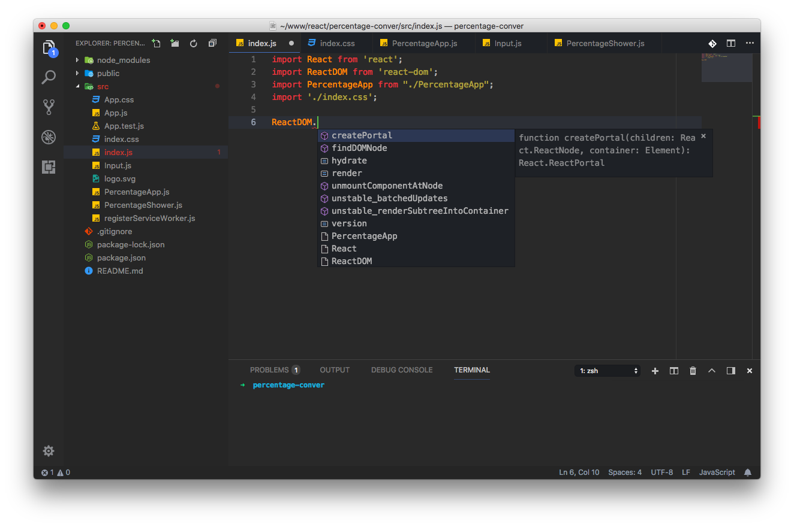

<p align="center">
	<a href="https://code.visualstudio.com">
		
	</a>
</p>

> 最新版本：[`v1.51`](https://code.visualstudio.com/updates/v1_51)

> 官网地址：[https://code.visualstudio.com](https://code.visualstudio.com)

效果预览：



> ⚠️ 注意：此预览图中的最终效果，基于图标主题 **「Material Icon Theme」** 和 颜色主题 **「One Monokai Theme」** 进行定制，详见下文中的自定义配置部分。

### 索引

1. [推荐自定义配置](#1-主题及配色方案)
2. [替代图标](#2-替代图标)
3. [快捷键](#3-快捷键)
4. [第三方插件](#4-第三方插件)
	- 4.1. [如何安装插件？](#41-如何安装插件)
	- 4.2. [推荐插件及配置](#42-推荐插件及配置)
5. [其它](#5-其它)

---

### 1. 推荐自定义配置

[点击这里](./settings.md)

### 2. 替代图标

[点击这里](./icons/README.md)

### 3. 快捷键

[点击这里](./keys.md)

### 4. 第三方插件

#### 4.1. 如何安装插件？

1. 搜索扩展
	- 方式一：`⌘P` 输入 `ext install [紧跟插件名或关键字]` 然后回车；
	- 方式二：左侧边栏单击扩展图标或使用快捷键 `⇧⌘X`，然后在搜索框输入要安装的插件名称；
2. 根据搜索到的插件列表，查找需要的插件，点击 `Install` ；
3. 插件安装好之后，点击 `Reload` 重新加载，或完全关闭 vscode 重新打开。

#### 4.2. 推荐插件及配置

以下是一些推荐的插件及基本配置，详细说明及配置项参见各插件对应的文档。

| 插件名称 | 说明 | 备注 |
| --- | --- | --- |
| [Settings Sync](https://marketplace.visualstudio.com/items?itemName=Shan.code-settings-sync) | 同步设置、主题、文件图标、快捷键等（最新版本已集成，此插件不再需要） |  |
| [Paste and Indent](#paste-and-indent) | 带格式的粘贴 |  |
| Alignment | 代码对齐格式化，同 sublime text 3 |  |
| Docker | Docker 相关文件高亮、语法检查、一些命令行工具等 |  |
| Git History | Git 功能增强，查看日志、文件历史、提交比较等 |  |
| [PHP IntelliSense](#php-intellisense) | PHP 语法检查、提示加强等 |  |
| [PHP Debug](./php_xdebug.md) | PHP 断点调试 |  |
| PHP DocBlocker | PHP 快速注释工具 |  |
| [Bracket Pair Colorizer](#bracket-pair-colorizer) | 括号高亮 |  |
| [Insert Date String](#insert-date-string) | 插入日期时间 |  |
| [ESLint](#eslint) | JS 语法检查 |  |
| JavaScript (ES6) snippets | ES6 代码片段快捷提示 |  |
| Log File Highlighter | 日志文件高亮 |  |
| Output Colorizer | 在 Output 面板高亮日志输出 |  |
| Markdown Preview Github Styles | Markdown 预览窗口使用 Github 的样式 |  |
| SVN | 追加 SVN 的一些操作 |  |
| ... |  |  |

下面是一些插件的推荐设置：

##### Paste and Indent

1. 修改文件 keybindings.json，追加以下设置（ctrl+v 带格式；ctrl+shift+v 原样）

	```json
	[
	    {
	        "key": "cmd+v",
	        "command": "pasteAndIndent.action",
	        "when": "editorTextFocus && !editorReadonly"
	    },
	    {
	        "key": "cmd+v",
	        "command": "editor.action.clipboardPasteAction",
	        "when": "!editorTextFocus"
	    },
	    {
	        "key": "cmd+shift+v",
	        "command": "editor.action.clipboardPasteAction",
	        "when": "editorTextFocus && !editorReadonly"
	    }
	]
	```

2. 修改用户配置 Preferences > Settings，追加如下设置

	```json
	"pasteAndIndent.selectAfter": true,
	```

##### PHP IntelliSense

```json
"php.executablePath": "/usr/bin/php",
"php.validate.run": "onType",
"php.suggest.basic": false,
```

##### Bracket Pair Colorizer

```json
"editor.matchBrackets": false,
"bracketPairColorizer.highlightActiveScope": true,
"bracketPairColorizer.showBracketsInGutter": true,
"bracketPairColorizer.showVerticalScopeLine": false,
"bracketPairColorizer.activeScopeCSS": [
    "borderStyle : none",
    "backgroundColor : {color}; opacity: 0.5"
],
```

##### Insert Date String

```json
// 插入日期时间 command + shift + i
//  DDDD, MMMM D, YYYY A HH:mm:ss -> Tuesday, April 3, 2018 PM 02:35:08
"insertDateString.format": "YYYY/MM/DD hh:mm:ss"
```

##### ESLint

1. 安装插件、重启；
2. 输入命令 `npm install -g eslint` 全局安装 `eslint` ；
3. 安装对应语言的规则，如 react 的

	```
	npm install --save-dev eslint-config-alloy eslint-plugin-react babel-eslint
	```

	其中：

	- `eslint-config-alloy` AlloyTeam 出的通用基础语法
	- `eslint-plugin-react` react 相关语法
	- `babel-eslint` es2015 语法
4. 在项目更目录下添加 `.eslintrc.js` 文件，并追加以下内容：

	```javascript
	module.exports = {
	    extends: [
	        'eslint-config-alloy/react',
	    ],
	    globals: {
	        // 这里填入你的项目需要的全局变量
	        // 这里值为 false 表示这个全局变量不允许被重新赋值，比如：
	        //
	        // React: false,
	        // ReactDOM: false
	    },
	    rules: {
	        // 这里填入你的项目需要的个性化配置，比如：
	        //
	        // // @fixable 一个缩进必须用两个空格替代
	        // 'indent': [
	        //     'error',
	        //     2,
	        //     {
	        //         SwitchCase: 1,
	        //         flatTernaryExpressions: true
	        //     }
	        // ],
	        // // @fixable jsx 的 children 缩进必须为两个空格
	        // 'react/jsx-indent': [
	        //     'error',
	        //     2
	        // ],
	        // // @fixable jsx 的 props 缩进必须为两个空格
	        // 'react/jsx-indent-props': [
	        //     'error',
	        //     2
	        // ]
	    }
	};
	```

5. 添加用户设置：

	```json
	"javascript.validate.enable" : false,
	"eslint.autoFixOnSave": true, // 保存时修复
	// "eslint.trace.server": "messages",// 输出 ESLint 执行时的 log，ESLint 不生效的时候可以启用看看
	"eslint.validate": [ // 配置检查的文件类型
	    "javascript",
	    "javascriptreact",
	    "html"
	],
	```

说明：以上配置参照自 [AlloyTeam ESLint 配置指南](http://www.alloyteam.com/2017/08/13065/)，更多内容请查看原文。


### 5. 其它

暂无
