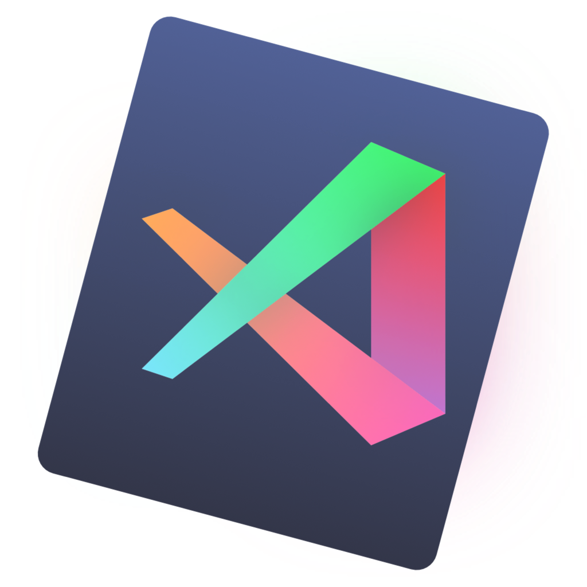

>
> 当前目录中为 png/icns 格式的图片
>
> macOS 系统可直接使用 icns 格式，windows 系统请下载后使用工具转换成 ico 格式
>
> 推荐一个在线转换工具：[iConvert Icons](https://iconverticons.com/online/)
>

    
    （官方默认）
    <a href="https://github.com/whorusq/vscode-settings/blob/master/icons/vscode.png">PNG下载</a> | <a href="https://github.com/whorusq/vscode-settings/blob/master/icons/vscode.icns">ICNS 下载</a>

    
    <a href="https://github.com/whorusq/vscode-settings/blob/master/icons/VSCodula.png">PNG下载</a> | <a href="https://github.com/whorusq/vscode-settings/blob/master/icons/VSCodula.icns">ICNS 下载</a>| <a href="https://dribbble.com/shots/6264729-VSCode-app-icon">作者：Armin Monirzadeh</a>

    
    <a href="https://github.com/whorusq/vscode-settings/blob/master/icons/visual-studio-code-mac-dark.png">PNG下载</a> | <a href="https://github.com/whorusq/vscode-settings/blob/master/icons/visual-studio-code-mac-dark.icns">ICNS 下载</a> | <a href="https://dribbble.com/shots/6293286-Visual-Studio-Code-2019-Icons">作者：SalGnt</a>

    
    <a href="https://github.com/whorusq/vscode-settings/blob/master/icons/visual-studio-code-mac-light.png">PNG下载</a> | <a href="https://github.com/whorusq/vscode-settings/blob/master/icons/visual-studio-code-mac-light.icns">ICNS 下载</a> | <a href="https://dribbble.com/shots/6293286-Visual-Studio-Code-2019-Icons">作者：SalGnt</a>

    
    <a href="https://github.com/whorusq/vscode-settings/blob/master/icons/visual-studio-code.png">PNG下载</a> | <a href="https://github.com/whorusq/vscode-settings/blob/master/icons/visual-studio-code.icns">ICNS 下载</a> | <a href="https://dribbble.com/shots/6293286-Visual-Studio-Code-2019-Icons">作者：SalGnt</a>

    
    <a href="https://github.com/whorusq/vscode-settings/blob/master/icons/vscode1.png">PNG下载</a> | <a href="https://github.com/whorusq/vscode-settings/blob/master/icons/vscode1.icns">ICNS 下载</a>

    
    <a href="https://github.com/whorusq/vscode-settings/blob/master/icons/vscode2.png">PNG下载</a> | <a href="https://github.com/whorusq/vscode-settings/blob/master/icons/vscode2.icns">ICNS 下载</a>

