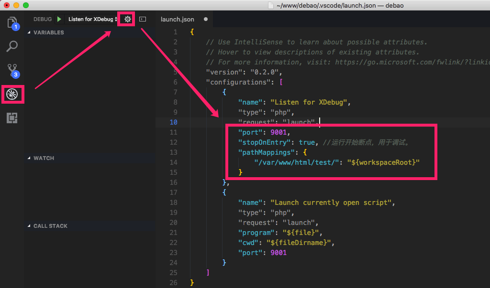
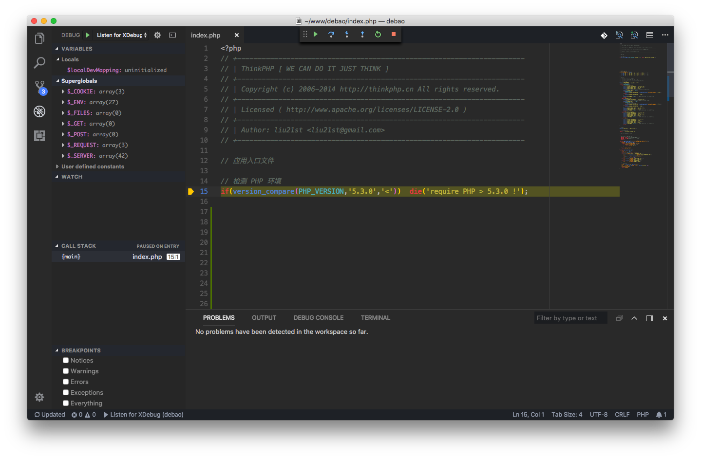

### 1. 安装插件 PHP Debug

- 安装

    快捷键 cmd + p 或 ctrl + p，输入 `ext install php debug`
    
    注意：安装完成后必须重启 vscode。
   
- 配置

    打开一个 PHP 项目，点击菜单 **Debug > Add Configuration**，或按照下图操作
    
    

    详细配置如下：

    ```json
    {
        // Use IntelliSense to learn about possible attributes.
        // Hover to view descriptions of existing attributes.
        // For more information, visit: https://go.microsoft.com/fwlink/?linkid=830387
        "version": "0.2.0",
        "configurations": [
            {
                "name": "Listen for XDebug",
                "type": "php",
                "request": "launch",
                "port": 9001, // 对应 XDebug 的配置
                "stopOnEntry": true,
                "pathMappings": {
                    // "容器中对应的项目地址": "本机项目地址"
                    // 绝对路径
                    "/var/www/html/debao/": "${workspaceRoot}"
                }
            },
            {
                "name": "Launch currently open script",
                "type": "php",
                "request": "launch",
                "program": "${file}",
                "cwd": "${fileDirname}",
                "port": 9001
            }
        ]
    }
    ```
    
    配置成功后，在项目下生成一个包含该配置的目录，如下：
    
    ```
    .
    ├── .vscode
    │   ├── launch.json
    ├── 其它项目文件
    ```

### 2. Docker 下的 PHP 环境

推荐直接克隆我之前封装的一个基于 Docker 的 [LNMPA 环境](https://my.oschina.net/antsky/blog/1627416)，当然你也可用使用你自己的 Docker PHP 环境，但是这里的配置是针对 Nginx + Apache 的组合形式，你可以根据具体环境进行调整。

详细如下：

#### 2.1. 安装、配置 XDebug 扩展

- 修改 Dockerfile 文件，安装 XDebug

    ```
    ...
    && mkdir -p /tmp/xdebug \
    && wget -c https://github.com/xdebug/xdebug/archive/2.6.0.tar.gz \
    && tar -xf 2.6.0.tar.gz -C /tmp/xdebug --strip-components=1 \
    && docker-php-ext-configure /tmp/xdebug --enable-xdebug \
    && docker-php-ext-install /tmp/xdebug \
    ...
    ```
    
    修改后，需要重新编译对应的镜像文件，更多安装扩展的方式请参考：[Docker 中的 PHP 如何安装扩展](https://my.oschina.net/antsky/blog/1591418)

- 配置 XDebug

    在 php.ini 文件追加以下配置
    
    ```ini
    [XDebug]
    zend_extension = xdebug.so
    xdebug.remote_enable = 1
    xdebug.remote_handler = dbgp
    xdebug.remote_port = 9001
    xdebug.remote_autostart = 1
    xdebug.remote_connect_back = 0
    xdebug.idekey = docker
    xdebug.remote_host = 192.168.2.14
    ```
    
    说明：
    
    - remote_port 默认 9000，为避免冲突，改为 9001
    - remote_host 是宿主机的 ip 地址

#### 2.2.  调整 Nginx server 配置

```
server {

    listen 80;
    server_name my.test; # 这里替换你的域名
    index index.html index.htm index.php;
    root /usr/share/nginx/html/test;

    ...

    location ~ .*\.(php|php5)?$ {
        proxy_pass http://php_apache:8091; # 这里是对应的 apache 容器地址和端口
        proxy_read_timeout 300;
        proxy_send_timeout 300;
        index index.php;
        proxy_set_header Host $host;
        proxy_set_header X-Real-IP $remote_addr;
    }

    ...
}
```

主要追加以下两个参数，用以解决在 debug 时 504 超时问题，具体数值可根据需要设置。

- proxy_read_timeout
- proxy_send_timeout

#### 2.3. 暴露 XDebug 通信接口

修改 docker-compose.yml 文件，在 nginx 和 apache 服务下通过 **expose** 暴露 **9001** 端口

使用如下命令重新启动服务

```
docker-compose stop
docker-compose down
docker-compose up -d
```

### 3. 测试断点调试

按快捷键 `F5` 打开断点，此时在浏览器中访问网页，将跳转到 vscode 编辑器，并且样式如下：



说明：上图是一个 TP 项目，虽然没有手动设置断点，但是开启调试模式后，访问网页会首先进入根目录下的框架入口文件。